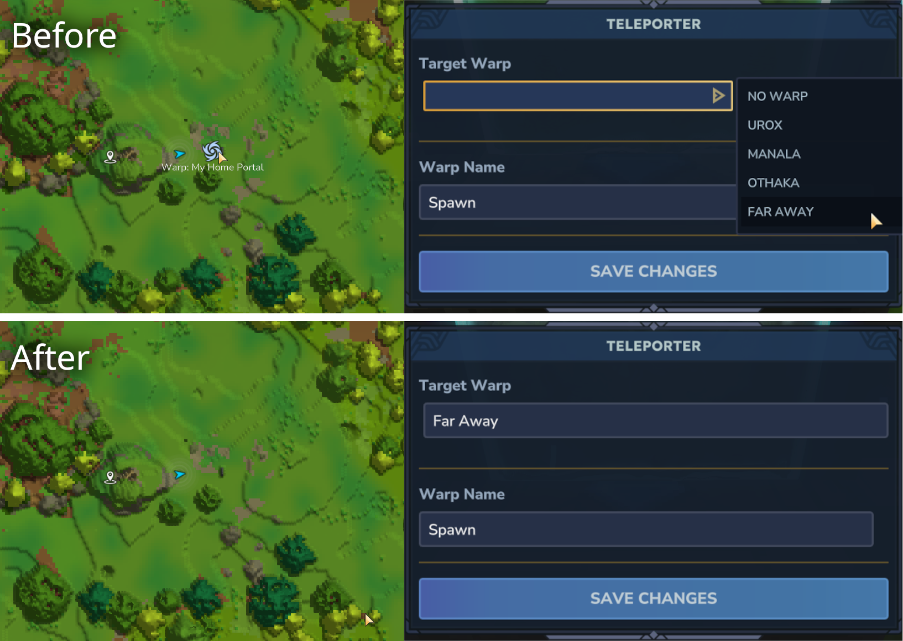

# Hidden Teleporters
A simple Hytale server mod that hides teleporter icons on the map and changes the
teleporter interaction user interface to have a text input instead of a dropdown box to prevent players from
seeing other target warps.

This is useful for PvP servers where players want to hide their portals or use secret codes for their portals.

Consider Checking out my Zone 404 vanilla focused Hytale anarchy server:

Join Address: `play.zone404.org`

Website: [zone404.org](https://zone404.org)

Discord: [https://discord.gg/BG9MBBNuAw](https://discord.gg/BG9MBBNuAw)

## License
MIT
